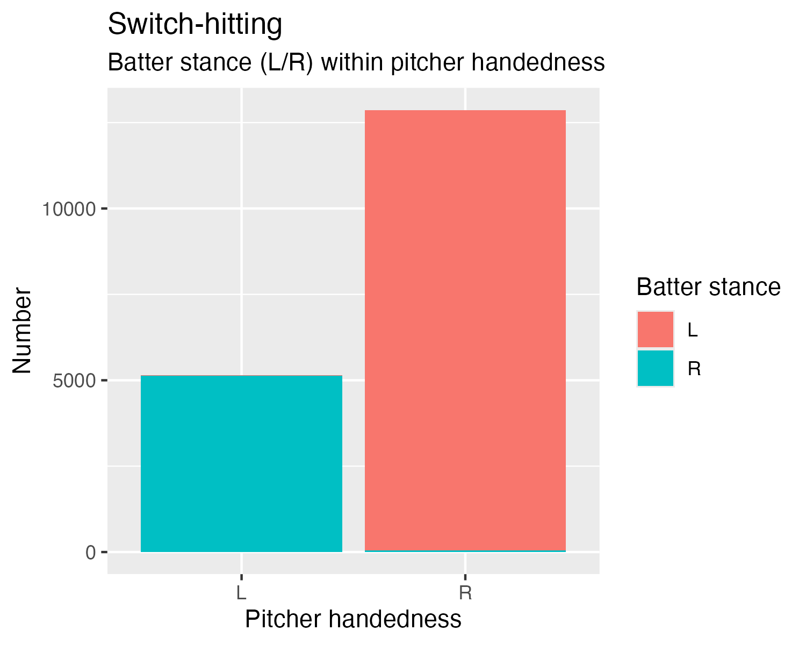
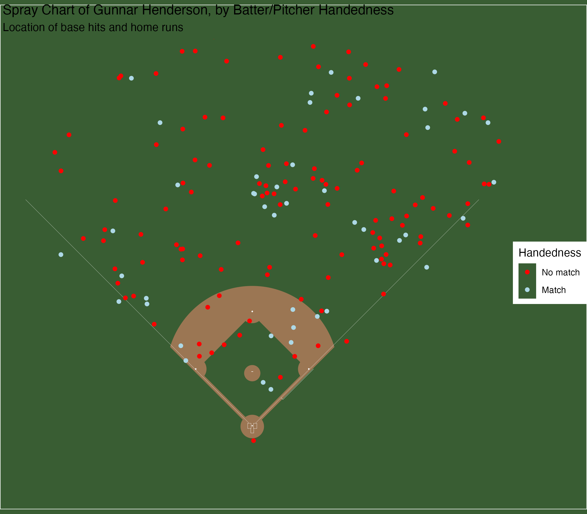
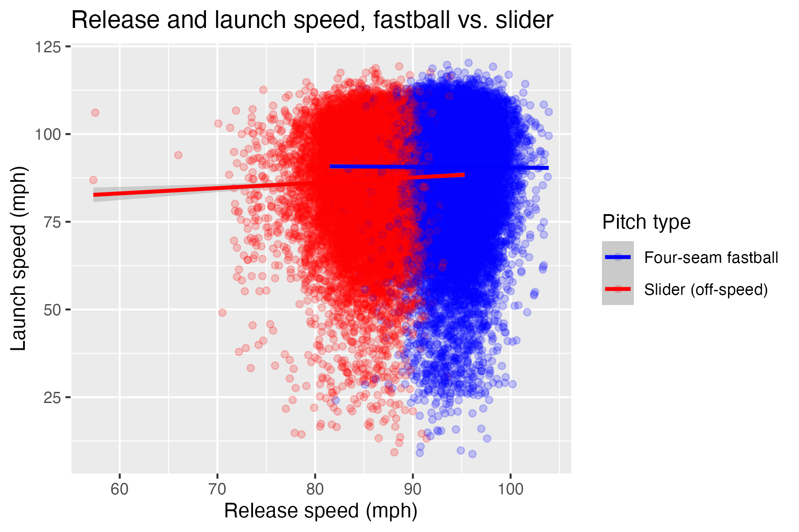
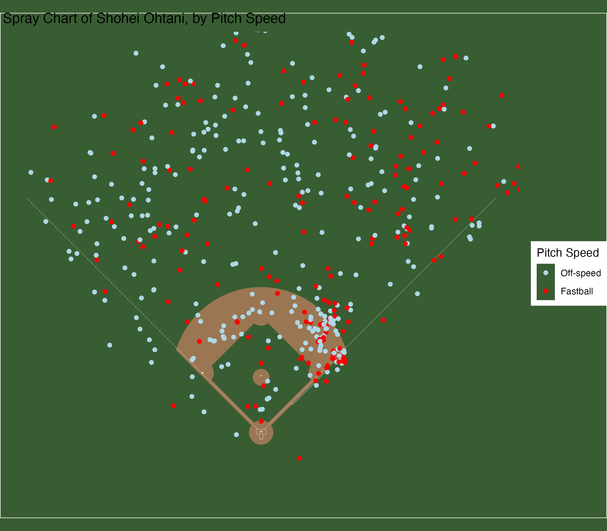

## Introduction

This report contains an elementary data analysis of Statcast data, sourced from Baseball Savant via the 2025 Connecticut Sports Analytics Symposium. The dataset contains pitch-level data for 701,557 pitches, thrown in Major League Baseball games between April 2, 2024 and October 30, 2024. I conduct two distinct analyses, focused on the platoon advantage and pitch characteristics.

## Section 1: Platoon Advantage

In the section on platoon advantage, I begin with an examination of batter stance and pitcher handedness. The platoon advantage refers to the supposed advantage that batters have against pitchers of the opposite hand (i.e. righties vs. lefties). Left-handed hitters are overrepresented in Major League Baseball, given the relatively low proportion of lefthanded people in the population. There are significantly more right-handed pitchers (because there are more right-handed people).

{#tbl-hands width="100%" height="100%"}

If hitters perform better against pitchers of the opposite hand, it would be advantageous to hit left-handed because batters are more likely to face righthanded pitchers. In fact, the 77 switch hitters in the MLB this season *always* chose to hit on the opposite side of the pitcher. 

{#fig-split}

My initial analysis showed there was no difference in outcome between split (L/R and R/L) and matched (L/L and R/R) hitter/pitcher combinations. However, when I mapped the hit location of right- and left-handed hitters and colored the data by batter/pitcher handedness, a different picture emerged. Players were significantly better against opposite pitchers, in hit location and batting average. For example, @fig-gunnar shows Gunnar Henderson's spray chart (of *safe* hits). Henderson throws right but bats left. In addition to the charts of single-sided hitters, I mapped the hits of four switch hitters as a bit of a control. Their performances mirrored the one-sided batters against opposite pitchers.

{#fig-gunnar}

## Section 2: Pitch Type Analysis
For my second focus, I looked at the specific pitches, namely their type (characterized by movement and speed). To make analysis based on pitch type easier, I divided the pitches by speed class, fastball and off-speed, seen in @tbl-pitchtype.

{width=100% height=100% #tbl-pitchtype}

I used this new variable in several multivariate analyses, including distribution of release speed and horizontal vs. vertical movement. I also, using a modified dataset in which each observation is a plate appearance, examined the proportions of pitch speeds given the speed or outcome of the pitch before. Fastballs are by far the most popular, but if an off-speed pitch is thrown first, there's a higher chance the second pitch will be an off-speed pitch as well. I also considered the numerical speed of the pitches when they leave the pitchers' hands and as they leave the bat. It might be tempting to assume that faster pitches result in higher exit velocities, but my analysis showed this was not the case. In @fig-release, we see that the distributions of exit velocity off of four-seam fastballs and sliders (off-speed) were nearly identical. 

{#fig-release}

The speed of the pitch has little to do with the launch speed of the ball; bat speed is a far better indicator. I also used similar spray charts to those in part 1, to model the hit locations of different styles of hitter (power, contact, combination) colored by speed (fastball or off-speed). For power hitters, off-speed pitches were better for going opposite field. Shohei Ohtani, a left-handed hitter, hits the majority of his right field home runs off of off-speed pitches, as seen in @fig-ohtani. Notice the general trend - he pulls fastballs and takes off-speed pitches opposite field. I devote a section to explaining the mechanics of a baseball swing explain this trend.

{#fig-ohtani width="100%"}

## Conclusion

The report combines univariate, bivariate, and multivariate analyses, conveyed via tables and plots, with baseball theory. I provide both the statistics as well as an explanation for why they are what they are. Using this Statcast data, I affirm the legitimacy of the platoon advantage and offer insight into the relationship between pitch speed and behavior.

This project is a work in progress. I submitted the original version as my final project for the STAT 301-1 course at Northwestern University. However, I am still working on adding to the two analyses and conducting further inquiries. Future renditions will include more work on bat speed and its effect on launch speed (exit velocity). I am also very interested in looking into more player-specific trends. Under which conditions are hitters more likely to succeed? Home field advantage, familiar field dimensions, friendly faces on the mound - do these matter?
